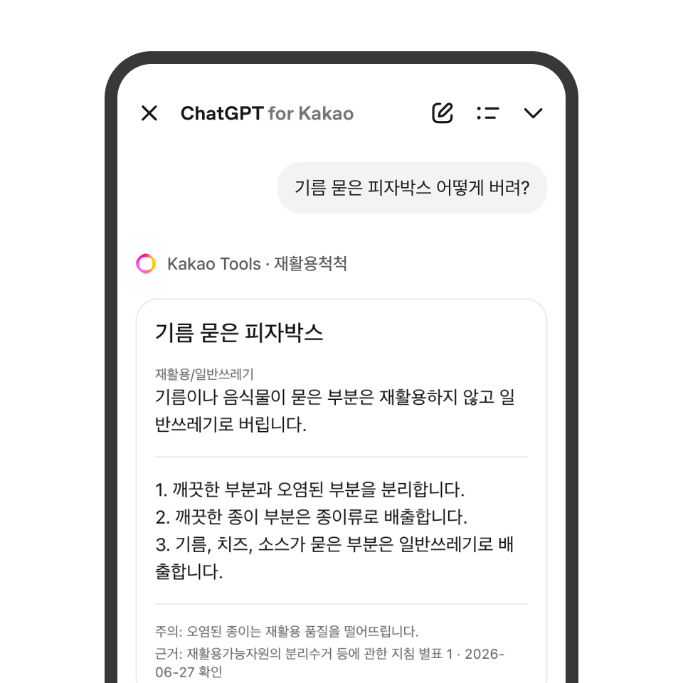
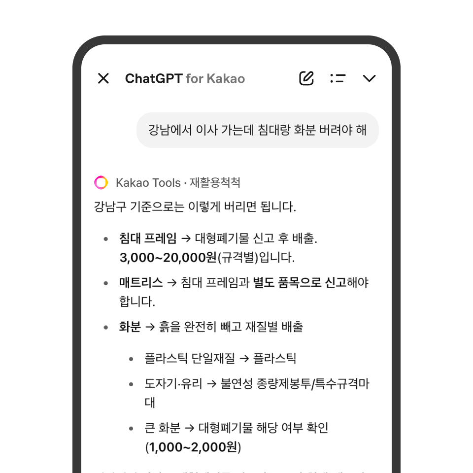

# 재활용척척 MCP

헷갈리는 생활폐기물의 올바른 배출 방법을 안내하는 remote MCP 서버입니다.
품목 분류, 단계별 배출 방법, 지역별 대형폐기물 수수료, 동네 수거함 위치까지
무상태(stateless) 서버 하나로 답합니다. 현재 카카오톡 **ChatGPT for Kakao — Kakao Tools**에서
`재활용척척`으로 서비스 중입니다.

## 무엇을 해주나

<p align="center">
  
  
</p>

- **"패트병 어떻게 버려?"** — 오타를 자모 유사도로 흡수해 페트병 배출 카드를 냅니다.
  단계별 안내에 공식 출처와 확인 일자가 붙습니다.
- **"컵은 어디에 버려?"** — 종이컵·플라스틱 컵·머그컵이 다 다르므로 임의로 하나를
  고르지 않고, 후보를 보여주며 재질을 되묻습니다.
- **"강남에서 이사 가는데 침대랑 화분 버려야 해"** — 여러 품목을 배출 그룹별로 묶고,
  그 지역 대형폐기물 수수료까지 얹어 계획을 세워 줍니다.
- **"상계동 사는데 폐건전지 어디 버려?"** — 법정동 기준으로 실제 수거함 주소를 찾아 안내합니다.
- **사진으로 물어도 됩니다.** 서버가 이미지를 받는 게 아니라, 비전을 가진 호스트가
  사진에서 품목명을 뽑아 넘기는 경로를 tool description으로 열어 두었습니다.

품목을 못 찾아도 재질 기준 안내로 착지합니다 — "모르겠다"로 끝내지 않는 것이
설계 원칙입니다. 호출이 한 번에 그칠 수 있는 환경을 전제로, 멀티스텝 체인 없이
**한 번의 호출로 항상 쓸모 있는 답**을 돌려줍니다.

## 연결하기

- Transport: **MCP Streamable HTTP**
- Endpoint: `POST /mcp` (헬스체크는 `GET /health`)
- Session: 무상태 — 요청마다 서버·도구를 새로 구성합니다
- Auth: 사용하지 않습니다
- `serverInfo.name`: `recycling-helper` (버전 `0.1.0`)

일반 MCP 클라이언트라면 이렇게 붙습니다.

```json
{
  "mcpServers": {
    "recycling-helper": {
      "type": "http",
      "url": "https://<서버 주소>/mcp"
    }
  }
}
```

카카오톡에서는 ChatGPT for Kakao의 Kakao Tools에 등록된 `재활용척척`을 켜면 됩니다.

## Tools

| Tool | 필수 인자 | 역할 |
| --- | --- | --- |
| `get_disposal_steps` | `itemName` | 단계별 배출 방법과 근거 출처 안내 — 주력 툴 |
| `classify_waste_item` | `itemName` | 품목 분류와 확신도·지역 영향 안내 |
| `check_confusing_item` | `itemName` | 헷갈리는 품목의 예외를 유사 품목과 비교 설명 |
| `make_cleanup_plan` | `items` (1~30개) | 여러 품목을 배출 그룹별로 묶어 계획 생성 |
| `get_region_disposal_info` | `region` | 지역별 확인 항목·신고 링크·수수료·공식 출처 |
| `find_disposal_spots` | `dong` (법정동) | 동네 수거함의 실제 주소 조회 |

`get_region_disposal_info`는 `region`이 필수입니다 — 빠지면 `-32602`로 되돌려주며 어떻게
채워야 하는지 알려 줍니다. `get_disposal_steps`·`classify_waste_item`·`make_cleanup_plan`·
`find_disposal_spots` 넷은 선택 인자라, 넣으면 그 지역 기준을 얹어 답합니다.
`check_confusing_item`은 `region`을 받지 않습니다.

`find_disposal_spots`만 외부 API — 기후에너지환경부 분리배출 정보조회 서비스(`getSpot`) —
를 실시간으로 부릅니다. 서버의 유일한 외부 런타임 의존이라 실패 설계를 함께 넣었습니다.
타임아웃 2.5초에 재시도 없음, 실패·0건 어느 쪽이든 오류를 던지지 않고 전국 확인 경로와
지역 공식 확인처로 내려앉습니다. 공공데이터포털 인증키(`DATA_GO_KR_SERVICE_KEY`)가
비어 있으면 이 툴은 `tools/list`에 아예 나오지 않으므로, 나머지 다섯 툴은 키 없이도
온전히 동작합니다.

## 응답 형태 — 위젯과 텍스트

**위젯 카드**를 내는 툴은 `get_disposal_steps`와 `classify_waste_item` 둘뿐이고,
그것도 품목 하나를 확정했을 때만입니다. `check_confusing_item`과 `make_cleanup_plan`은
언제나 텍스트로 답합니다. 카드는 제목·캡션·단계·주의·근거에 지역 블록까지 얹은
Kakao Tools 전용 형식이고, 그대로 복사해 공유할 수 있는 `copy_text`가 따라갑니다.

두 툴도 확정이 아닐 때는 텍스트로 답합니다.

- `ambiguous` — 후보를 제시하고 재질·용도를 되묻습니다. 임의로 확정하지 않습니다.
- `not_found` — 재질 기준 일반 안내로 착지합니다.

위젯은 Kakao Tools에서만 그려지므로, 일반 MCP 클라이언트용으로 띄우는 배포에서는
`WIDGET_ENABLED=false`로 두고 텍스트 응답을 받습니다. 클라이언트마다 고를 수 있는 값이
아니라 프로세스 전체를 덮는 서버 스위치라, 켜 둔 서버에서 끄면 카카오톡 위젯도 같이
꺼집니다. 끈 상태에서 `get_disposal_steps`는 같은 내용을 마크다운으로 낼 뿐이지만
`classify_waste_item`은 분류 요약으로 답 자체가 바뀝니다 — 차이는
[docs/design-notes.md](docs/design-notes.md#widget_enabledfalse로-되돌렸을-때의-차이)에,
운영 중 되돌리기 절차는 [docs/qa-runbook.md](docs/qa-runbook.md)에 있습니다.

자유 형식 질의는 완전 일치부터 자모 분해 오타 허용까지 다섯 단계 점수로 매칭하고,
"컵"·"통"처럼 여러 품목에 걸치는 포괄어는 확정하지 않습니다. 점수 체계와 복합명사
처리, 사진 입력 경로, 응답 편집 규칙 같은 세부 설계는
[docs/design-notes.md](docs/design-notes.md)에 정리해 두었습니다.

## 데이터 커버리지

- 품목 데이터: `src/data/waste-items.json` (336개)
- 지역 정책 데이터: `src/data/region-policies.json` (57개 지역 — full 5, standard 35, metro 17)
- 대형폐기물 수수료: `src/data/bulky-waste-fees.json` (28개 지역 3,829행)

지역 데이터는 세 티어로 나뉩니다.

- `full` — 배출 요일·수거함·대형폐기물 수수료 기준까지 (서울 강남·서초·송파·마포, 성남)
- `standard` — 대형폐기물 신고 링크·직통번호·폐의약품/폐건전지 수거함 안내까지.
  서울 21개 구, 경기 6개 시, 광역시 자치구 8곳
- `metro` — 17개 시·도 광역 폴백. 자치구 데이터가 없어도 매칭이 실패하지 않습니다

`full`과 `standard`를 합치면 서울은 25개 구 전부, 경기는 7개 시가 들어 있습니다.

`standard`는 다섯 항목이 전부 공식 출처로 확인된 지역만 넣습니다. 하나라도 못 채우면
[docs/data-decision-backlog.md](docs/data-decision-backlog.md)에 사유와 함께 남깁니다.

## 데이터 신뢰도

품목·지역 데이터는 네 단계를 통과해야 반영됩니다.

1. `pnpm validate:data` — 스키마·문서 카운트 정합성
2. `pnpm eval:data` — 평가셋 1:1 매칭 검증. 대표 질문 평가셋 `src/data/evaluation-cases.json` (336개),
   지역 평가셋 `src/data/region-evaluation-cases.json` (136개)
3. `pnpm smoke:mcp` — 실서버를 띄워 답변 회귀 케이스 `src/data/mcp-answer-cases.json` (637개) 실행
4. 질문 백로그 (`src/data/question-backlog.json`) — 새로 발견한 갭을 추적해 후속 작업으로 승격
   ([docs/question-backlog.md](docs/question-backlog.md))

품목 리뷰 상태: `verified` 44 / `region_review_needed` 91 / `needs_source` 7 / `standard_import` 194.
이 수치들은 전부 `validate:data`가 실제 데이터와 대조하므로 낡은 채로 남지 않습니다.

전체 검증은 한 번에 돌립니다.

```bash
pnpm local:test
```

## 직접 실행

```bash
pnpm install
pnpm build
PORT=3000 pnpm start        # http://localhost:3000/mcp
```

Docker:

```bash
docker build -t recycling-helper-mcp .
docker run --rm -p 3000:3000 recycling-helper-mcp
```

AMD64 환경(대부분의 클라우드 Kubernetes)에 올릴 이미지는 Apple Silicon에서
`--platform linux/amd64`로 빌드합니다. Kubernetes manifest는 `k8s/`에 있습니다.

### 환경변수

| 변수 | 역할 | 기본값 |
| --- | --- | --- |
| `PORT` / `HOST` | 리슨 포트·바인드 주소 | `3000` / `127.0.0.1` (Docker는 `0.0.0.0`) |
| `DATA_GO_KR_SERVICE_KEY` | 공공데이터포털 인증키. 없으면 `find_disposal_spots` 미등록 | 없음 |
| `WIDGET_ENABLED` | `false`일 때만 위젯 카드 대신 텍스트 응답 | 켜짐 |
| `ALLOWED_HOSTS` | `/mcp` Host 검증 허용 목록 (콤마 구분, `*.` 와일드카드) | `localhost`, `127.0.0.1`, `[::1]`, `*.playmcp-endpoint.kakaocloud.io` |
| `ALLOWED_ORIGINS` | CORS 허용 오리진 | 서비스 채널 도메인 |
| `SPOT_CACHE_TTL_MS` | 수거함 조회 캐시 TTL. `0`이면 끔 | `300000` (5분) |
| `CALL_LOG_DETAILS` | `true`면 로그에 호출 인자·예외 원문 포함 — 로컬 디버깅 전용 | 꺼짐 |
| `MOE_API_BASE_URL` | getSpot API 주소 오버라이드 — 테스트에서 목 서버 주입용 | 공공데이터포털 |

기본 허용 목록에 없는 자기 도메인으로 셀프호스팅하면 `/mcp` 요청이 전부
`403 Invalid Host`로 막히니, `ALLOWED_HOSTS`에 그 도메인을 넣어야 합니다.

## 데이터 출처

- 기후에너지환경부 현행법령: https://www.mcee.go.kr/home/web/index.do?menuId=70
- 환경부 분리수거 요령: https://www.me.go.kr/webdata/education/class21/8-03.html
- 생활폐기물 분리배출 누리집: https://www.분리배출.kr/front/region/region.do

여기에 지자체별 공식 페이지·자치법규를 지역 데이터의 근거로 사용하며, 모든 안내에는
출처 제목과 확인 일자가 붙습니다. 출처 관리 기준은
[docs/source-coverage.md](docs/source-coverage.md)와
[docs/source-gap-policy.md](docs/source-gap-policy.md)를 보세요.

## 더 읽기

- 설계 노트 (매칭·사진 입력·응답 편집): [docs/design-notes.md](docs/design-notes.md)
- 개발·로컬 검증 흐름: [docs/local-mcp-workflow.md](docs/local-mcp-workflow.md)
- 운영 런북 (장애 대응·로그 판독): [docs/qa-runbook.md](docs/qa-runbook.md)
- 데이터 작업 가이드: [docs/data-quality.md](docs/data-quality.md)
- 지역 정책 비교: [docs/region-policy-comparison.md](docs/region-policy-comparison.md)
